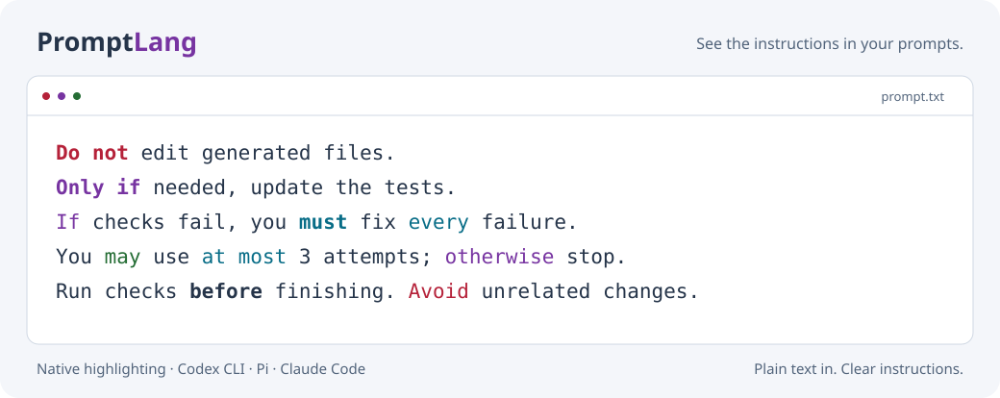

# PromptLang

[](https://github.com/Vanclief/promptlang/actions/workflows/ci.yml)

**See the instructions in your prompts.**

PromptLang highlights the words that shape an instruction: conditions,
prohibitions, requirements, limits, and permissions. It colors your draft as you
type and keeps the submitted prompt plain text.

<picture>
  <source media="(prefers-color-scheme: dark)" srcset="docs/assets/preview-dark.svg">
  
</picture>

| Client | Integration | Highlighting appears in |
| --- | --- | --- |
| **Codex CLI** | Separate build of Codex 0.153.4 | Native prompt composer |
| **Pi** | Custom editor extension | Native prompt composer |
| **Claude Code** | External terminal editor | **Ctrl+G** while editing a draft |

Early prototype for **macOS and Linux**. Colors follow your terminal's palette;
the preview illustrates one light/dark palette. This is a lexical highlighter,
not a model-specific compiler or a measured ranking of keyword effectiveness.

## Install

Clone the repository and choose a client:

```sh
git clone https://github.com/Vanclief/promptlang.git
cd promptlang
```

| Install | Run from any project |
| --- | --- |
| `./install.sh codex` | `promptlang-codex` |
| `./install.sh claude` | `promptlang-claude` |
| `./install.sh pi` | `promptlang-pi` |

Or install all three with `./install.sh all`.

The installer prepares dependencies and adds launchers to `~/.local/bin`. It
refuses to overwrite unrelated commands. Your existing `codex`, `claude`, and
`pi` commands and client settings stay in place. **Keep the cloned repository:**
the launchers use it. Normal client arguments are forwarded, and the current
working directory is preserved.

If the launcher directory is not on your PATH, add this to your shell startup
file (`~/.zshrc` for zsh or `~/.bashrc` for bash), then open a new terminal:

```sh
export PATH="$HOME/.local/bin:$PATH"
```

Use `--bin-dir /your/bin` for a different destination. You can also run launchers
directly from `./bin/` after setup.

### Requirements

- **Claude and Pi:** Node.js **22.19+** with npm. Claude Code must already be
  installed. Pi uses your installed CLI, or the pinned local Pi **0.85.0** that
  setup installs as a dependency.
- **Codex:** Rust installed through rustup, Python 3, Git, curl, tar, shasum, and
  a C/C++ build toolchain. The pinned source selects Rust **1.95.0**. On macOS,
  install Xcode Command Line Tools. Linux needs the native build dependencies,
  including a C/C++ compiler and development libraries required by Codex.

**Codex's first setup compiles upstream Codex and can take considerable time and
disk space.** Later builds reuse the cache. Setup downloads the matching official
Code Mode runtime and verifies its pinned SHA-256; an existing Codex installation
is not required. Prebuilt PromptLang binaries are not published yet.

## Using it

Try typing this draft to see the categories:

```text
Do not edit generated files. Only if needed, update the tests.
If checks fail, you must fix every failure before finishing.
You may use at most 3 attempts; otherwise stop.
```

### Codex CLI

Start `promptlang-codex` and type normally. Keywords update while you edit, wrap,
and search your history. Native mentions, attachments, shell mode, and masked
input keep their existing presentation. This uses your normal Codex login and
configuration. The desktop and IDE composers are separate.

### Pi

Start `promptlang-pi` and type normally. The extension retains Pi's app shortcuts,
history, cursor, wrapping, autocomplete, and pasted-text expansion.

For persistent installation in the regular `pi` command:

```sh
pi install /absolute/path/to/promptlang
```

Then start a new Pi session. Use either persistent installation or the launcher
so the extension loads once. Pi has one custom editor slot; another editor
extension can replace PromptLang depending on load order. Non-interactive and
RPC sessions are unaffected. See Pi's
[extension documentation](https://github.com/earendil-works/pi/blob/main/packages/coding-agent/docs/extensions.md).

### Claude Code

Start `promptlang-claude`, type a draft, and press **Ctrl+G**.

| In the highlighted editor | Action |
| --- | --- |
| **Enter** | Insert a newline |
| **Ctrl+S** | Save and return to Claude's draft |
| **Ctrl+C** | Cancel and keep the original draft |

Saving returns the text to Claude **without submitting it**. The launcher sets
`VISUAL` and `EDITOR` for that Claude process and its children. Other Claude
actions that open the configured external editor use PromptLang too.

Claude's documented extension API has no input-token rendering hook, so
highlighting is available through its supported
[external editor shortcut](https://code.claude.com/docs/en/interactive-mode).
Its built-in composer is unchanged. Tested end to end with Claude Code **2.1.267**.

Cancel and no-op saves preserve the original file byte-for-byte. Actual edits use
Pi's editor conventions: LF newlines and tabs expanded to four spaces. Save
reports a conflict if another process changes the file while you edit.

## The colors

| Meaning | Style | Examples |
| --- | --- | --- |
| Prohibitions / negation | **Bold red** | `DO NOT`, `MUST NOT`, `DON'T`, `NEVER`, `NOT` |
| Restrictions / exceptions | **Bold magenta** | `ONLY IF`, `ONLY`, `UNLESS`, `EXCEPT` |
| Conditions / branches | Magenta | `IF`, `WHEN`, `THEN`, `ELSE`, `OTHERWISE` |
| Direct instructions | **Bold cyan** | `DO`, `MUST`, `ENSURE`, `REQUIRED`, `MAKE SURE` |
| Quantities / limits | Cyan | `EVERY`, `ALL`, `EXACTLY`, `AT LEAST`, `AT MOST` |
| Order / timing | **Normal foreground, bold** | `BEFORE`, `AFTER`, `UNTIL`, `FIRST`, `FINALLY` |
| Permission / preference | Green | `MAY`, `OPTIONAL`, `SHOULD`, `PREFER`, `NOT REQUIRED` |
| Advice against an action | Red | `AVOID`, `SHOULD NOT` |

Red and green use familiar stop/permission conventions. Bold gives firm
instructions more visual weight without relying on hue alone. Ordinary prose
keeps the default foreground, and instructions are never dimmed. Actual shades
and contrast depend on your [terminal theme](https://code.visualstudio.com/docs/terminal/appearance).

Matching ignores case and respects Unicode word boundaries. The longest phrase
wins: **`do not` is red; `do not have to` is green**. Phrases can span whitespace
and line breaks, but cannot cross punctuation. `not only` and `do you` stay plain.

This is a vocabulary, not a full English parser. Words inside quotes or code can
match, and `May` can also be a month. Highlighting does not infer full clause scope
or change what a model receives.

## Update or uninstall

```sh
git pull --ff-only
./install.sh pi       # or claude, codex, all
```

```sh
./install.sh all --uninstall
```

Uninstall removes only PromptLang-managed launchers. If you installed Pi's
extension persistently, also run `pi remove /absolute/path/to/promptlang`.
Use the same `--bin-dir` when uninstalling from a custom location. Client
installations, settings, the repository, and build caches are kept.

## Development

```sh
npm ci --ignore-scripts
npm test
```

Twenty JavaScript tests cover editor rendering, cursor behavior, Unicode,
pastes, Claude save/cancel, and installer safety. CI runs them on macOS/Linux
with Node 22/24. The Codex overlay has 15 passing prototype tests; its full suite
has 35 known upstream failures reproduced without PromptLang.

See [development notes](docs/development.md) for Codex builds, tests, dependency
pins, vocabulary changes, and preview generation. Small contributions and
reproducible bug reports are welcome; include the client version, terminal,
platform, and a minimal prompt that shows the problem.

[Apache-2.0](LICENSE). Independent project; see [NOTICE](NOTICE) for upstream attribution.
